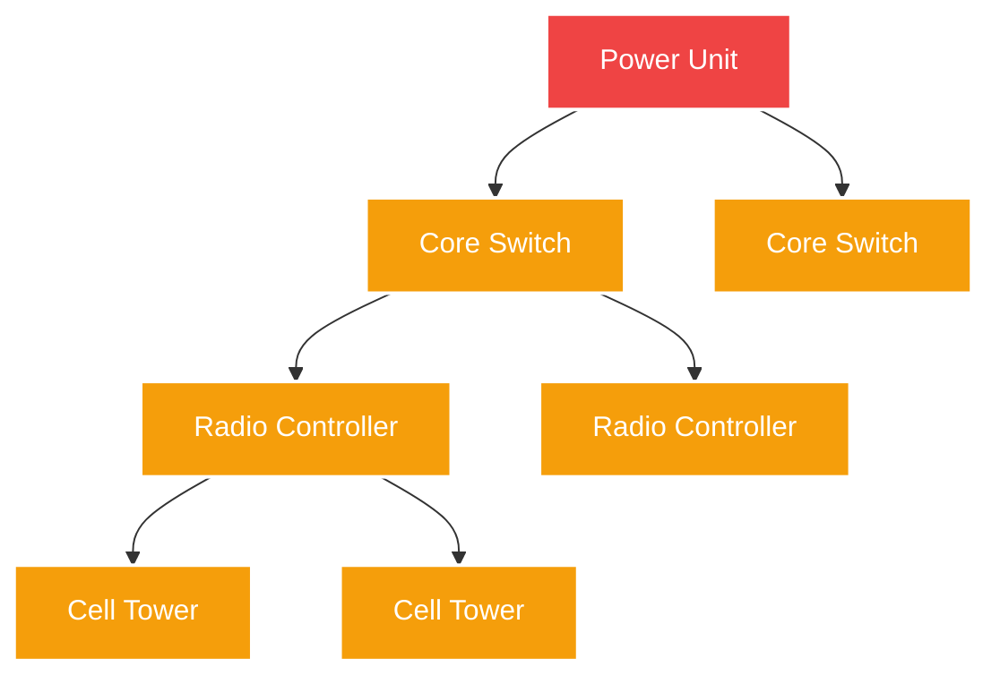

<p align="center">
  
</p>
<h1 align="center">Telco-RCA</h1>                  
<p align="center">
  <strong>5G Network Root Cause Analysis Environment</strong><br>
  <em>Team Codyy AR · April 2026</em>
</p>

<p align="center">
  <a href="https://ayushman098-telco-rca.hf.space/"></a>
  
  
  
</p>

<hr>

> **Telco-RCA** is a massive-scale reinforcement learning environment simulating cascading telecommunications hardware failures. AI agents must diagnose up to 500 nodes in physical networks, fighting through adversarial noise to find the root cause, as fast as possible, with zero false positives.

## ✨ Highlights

| 🌐 **Scale & Graph Reasoning** | ⚡ **Efficiency Under Pressure** | 🛠️ **Real-World Fidelity** |
|:---|:---|:---|
| Navigate a dynamic 500-node Knowledge Graph mapping physical dependencies. | MTTR (Mean Time to Recovery) scoring penalizes wasted diagnostic steps. | 40% adversarial noise simulates real-world alarm fatigue and transient errors. |
| Correlate parent-child hierarchies across 5 geographic regions. | Heavy F1 penalties for "False Positives" (dispatching crews to wrong elements). | Built strictly to the **OpenEnv** spec with deterministic seeding and Pydantic validation. |

<br>

---

## 🌐 The Problem & The Cascade

Modern 5G networks are bound by physical hierarchies. When a single **Power Unit** fails, the cascade effect triggers hundreds of simultaneous alarms across dependent regions. Engineers take hours to find the true culprit. Agents are trained to do it in seconds.



---

## 🎮 Task Tiers

Four rigorously tuned difficulty tiers for telecom root cause analysis:

| Task Level | Nodes | Regions | Alarms Triggered | Noise Level | Max Actions | Description |
|:---|:---:|:---:|:---:|:---:|:---:|:---|
| 🟢 **Easy** | 20 | 1 | 5–20 | 0% | 15 | **Alarm Classification:** Single fault mapping to downstream towers. Tests basic topological inference. |
| 🟡 **Medium**| 100 | 3 | 10–50 | 20% | 30 | **Multi-Alarm Correlation:** Correlate parallel failures across regional boundaries. Introduces distractor noise. |
| 🔴 **Hard** | 500 | 5 | 50–300 | 40% | 50 | **KG Traversal:** Extensive 500-node graph tracing. The agent must distinguish critical physical hardware faults from sweeping logical cascades. |
| ⚫ **Extreme** | 1000 | 8 | 100–600 | 60% | 75 | **Worst-Case RCA:** Deep multi-hop diagnosis under heavy noise. Tests branch pruning, signal filtering, and confident final selection. |

Each reset now builds the exact configured node count for the chosen task instead of using a looser lower-bound topology.

---

## ⚡ Action Space

Agents have access to specialized operational actions. Each action carries distinct costs and informational returns:

| Action Command | Cost | Operational Outcome |
|:---|:---|:---|
| `CHECK_LOGS` | -0.01 | Read error logs (layer, parent, textual clues). |
| `CHECK_VOLTAGE`| -0.01 | Measure terminal voltage (Voltage drop <30V isolates hardware fault). |
| `TRACE_PATH` | -0.01 | Map the exact upstream route from a leaf node to the core. |
| `RESTART` | -0.01 | **CRITICAL:** Fix the network if correct. *Heavy `-0.3` deduction if wrong.* |
| `DIAGNOSE` | -0.01 | Declare root cause safely (caps max potential reward). |

---

## 📈 Reward Architecture

The scoring system mirrors real-world Network Operations Center (NOC) KPIs, resulting in a strict deterministic `[0.0, 1.0]` curve:

$$ Score = CLAMP(Efficiency + (Speed * 0.2) - FPPenalty) $$

- **Efficiency:** $1.0 - (steps\_taken / max\_steps)$
- **Speed Bonus (MTTR):** Agent receives maximum bonus for returning under 300 seconds.
- **Precision Penalty:** `-0.15` per False Positive.

---

## 🚀 Quick Start

### 1. Run the Dashboard & API (Docker)

```bash
docker build -t telco-rca .
docker run -p 7860:7860 \
  -e API_BASE_URL=https://api.anthropic.com/v1 \
  -e MODEL_NAME=claude-sonnet-4-20250514 \
  -e HF_TOKEN=your_key \
  -e PUBLIC_BASE_URL=http://localhost:7860 \
  -e INTERNAL_API_TOKEN=change-me \
  telco-rca
```
*Visit `http://localhost:7860` for the animated web dashboard.*

### 1a. Hugging Face Space Variables / Secrets

Configure these in the Space settings instead of committing them:

- `HF_TOKEN`: provider token used by `inference.py`
- `OPENAI_API_KEY`: accepted as a fallback alias by `inference.py`
- `API_BASE_URL`: upstream LLM endpoint
- `MODEL_NAME`: model identifier
- `PUBLIC_BASE_URL`: your public Space URL, for example `https://ayushman098-telco-rca.hf.space`
- `INTERNAL_API_TOKEN`: optional token for `/state/internal`
- `ALLOWED_ORIGINS`: optional comma-separated override for CORS if you want to replace the default local + `*.hf.space` policy

The React frontend uses same-origin API calls by default, so the Space does not need a separate frontend API base URL.

### 2. Standard Local Environment
```bash
pip install -r requirements.txt
npm ci

# Terminal 1: FastAPI backend
uvicorn app.main:app --host 0.0.0.0 --port 7860

# Terminal 2: React/Vite frontend
npm run dev

# Production frontend build served by FastAPI
npm run build

# Optional test pass
pytest tests/ -v
```

The Vite app builds into `app/static/`, so a production build is served directly from the FastAPI root route.

### 3. Run Baseline Agent
We provide a compliant `inference.py` script bridging heuristics with OpenAI-spec LLM API clients. It accepts either `HF_TOKEN` or `OPENAI_API_KEY` and emits structured `[START]`, `[STEP]`, and `[END]` JSON logs:
```bash
SERVER_URL=https://ayushman098-telco-rca.hf.space \
python inference.py
```

### 4. Run the Benchmark Sweep
The repo also includes `run_baseline.sh`, which executes the baseline across every task multiple times, then summarizes mean/std score plus MTTR:
```bash
chmod +x run_baseline.sh
./run_baseline.sh --episodes 5 --output artifacts/baseline_report.txt
```

The script writes a clean report and keeps a format example in:
- [`artifacts/baseline_report_example.txt`](artifacts/baseline_report_example.txt)

---

## 📡 Base API Reference

| Verb | Path | Output Signature |
|:---|:---|:---|
| `GET` | `/health` | Liveness constraint & versioning |
| `GET` | `/tasks` | Detailed metadata for all defined topology tasks |
| `POST`| `/reset` | Bootstraps a chaotic graph state: `{"task": "hard", "seed": 42}` |
| `POST`| `/step` | Evaluates diagnostics: `{"task": "hard", "action": {...}}` |
| `GET` | `/state` | Safe runtime state for the dashboard and grading inputs; does not expose the hidden root cause |
| `GET` | `/trajectory` | Structured trajectory data for the solved path, timing, and reward breakdown |
| `GET` | `/state/internal` | Optional token-protected debug state; send `X-Admin-Token` |
| `POST`| `/grade` | Calculates explicit precision/recall F1 scores mapped to MTTR |

<p align="center">
  <br>
  <i>Built with FastAPI · React · Vite · Tailwind CSS · OpenEnv</i>
</p>
