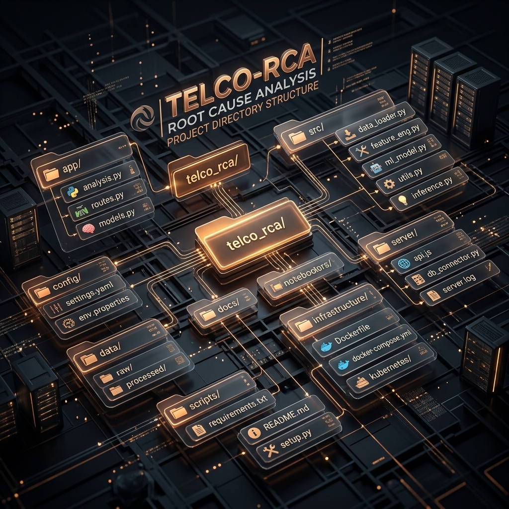
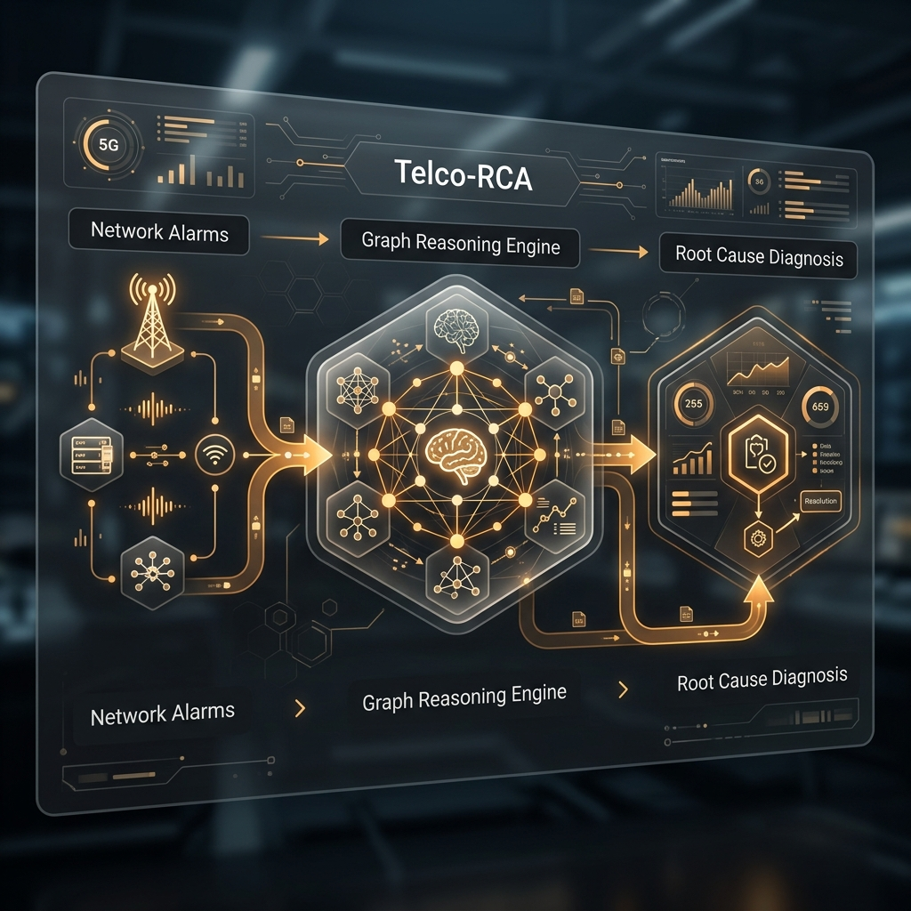
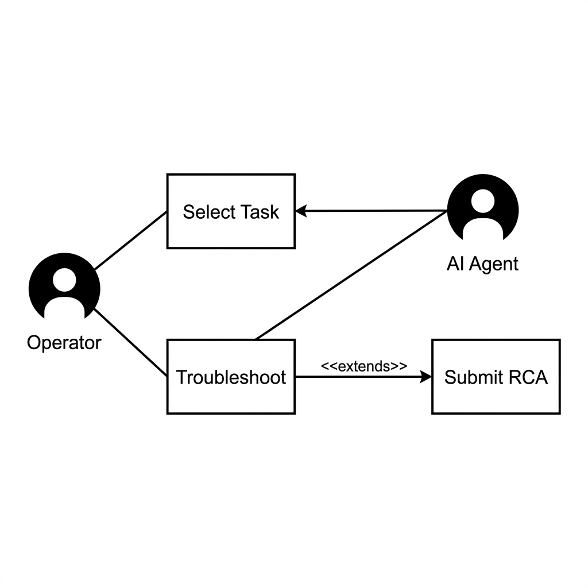
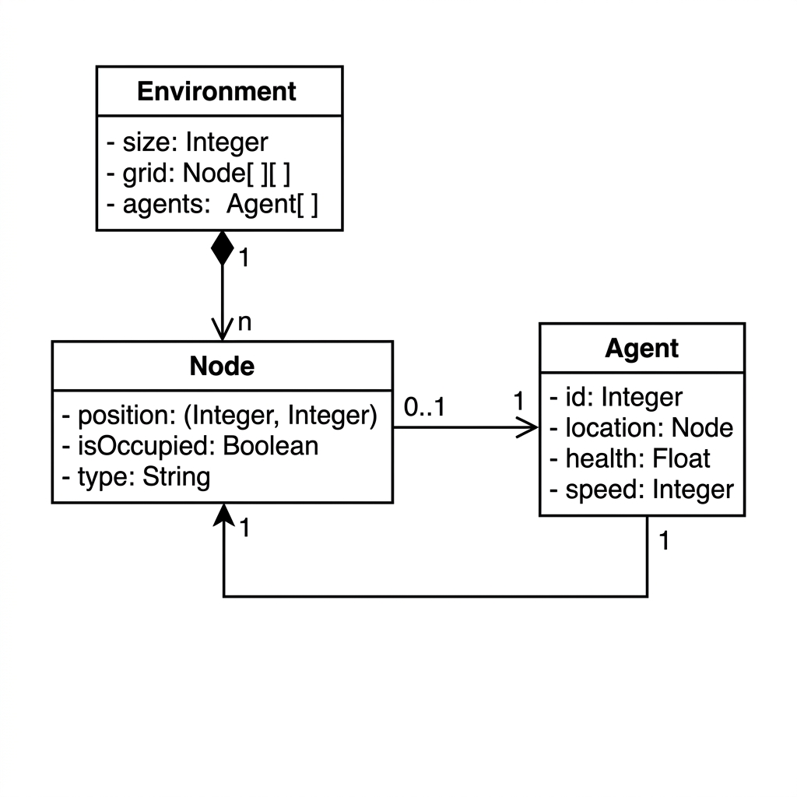
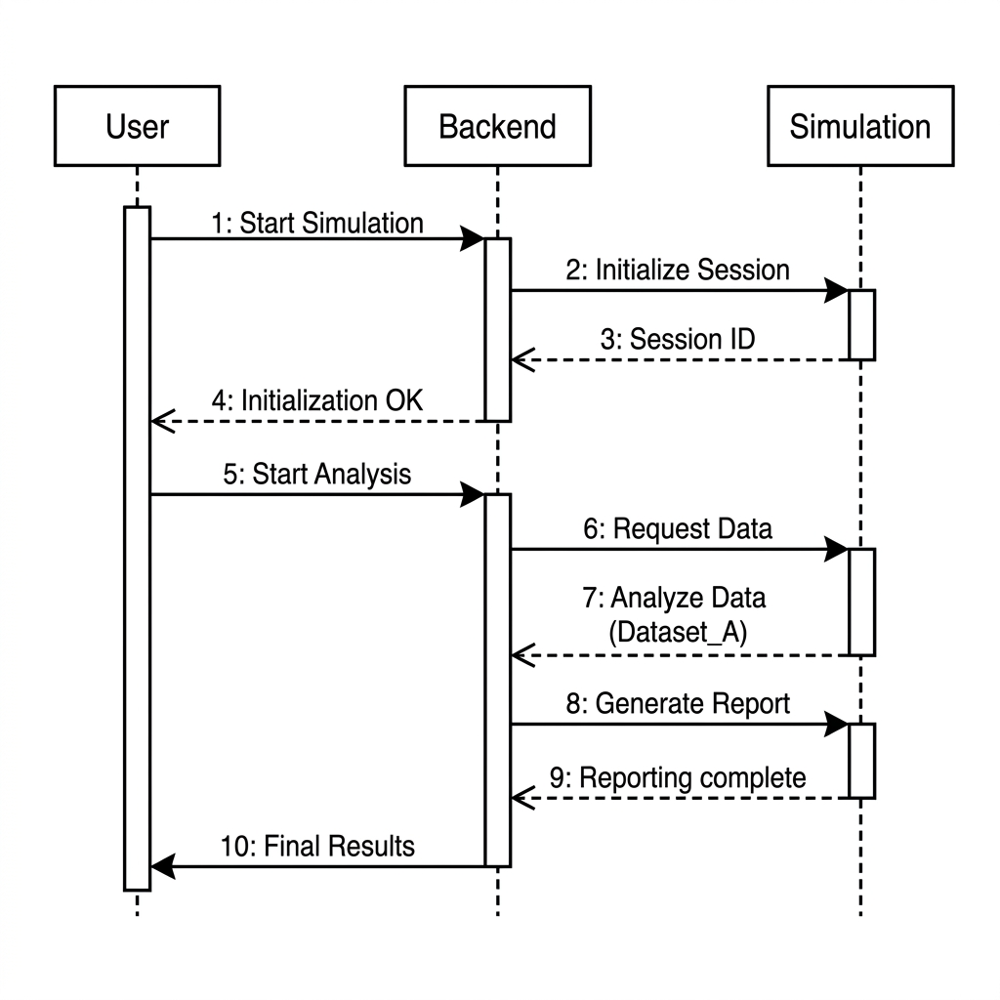
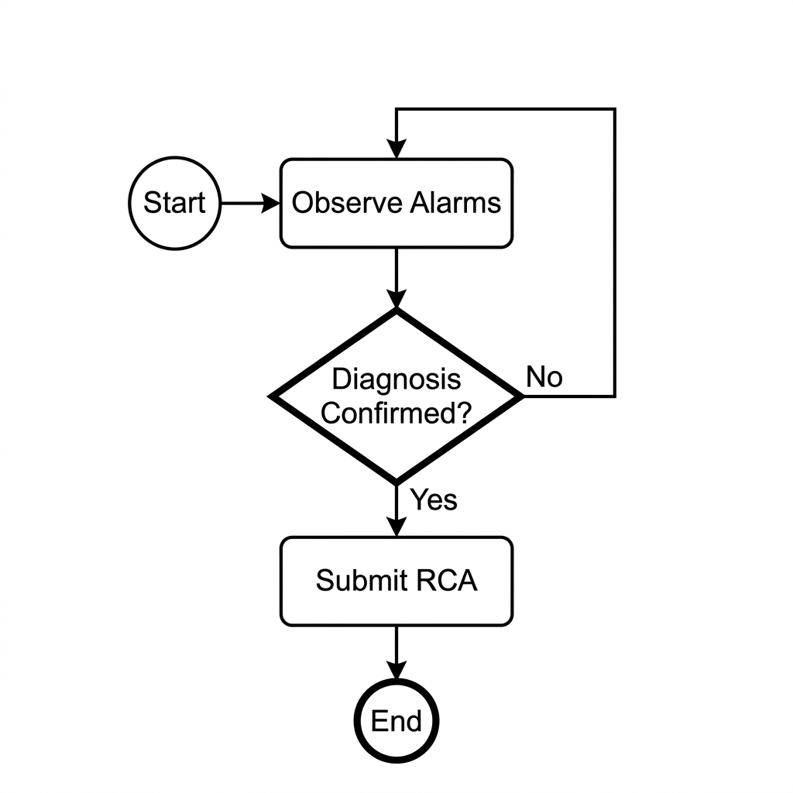
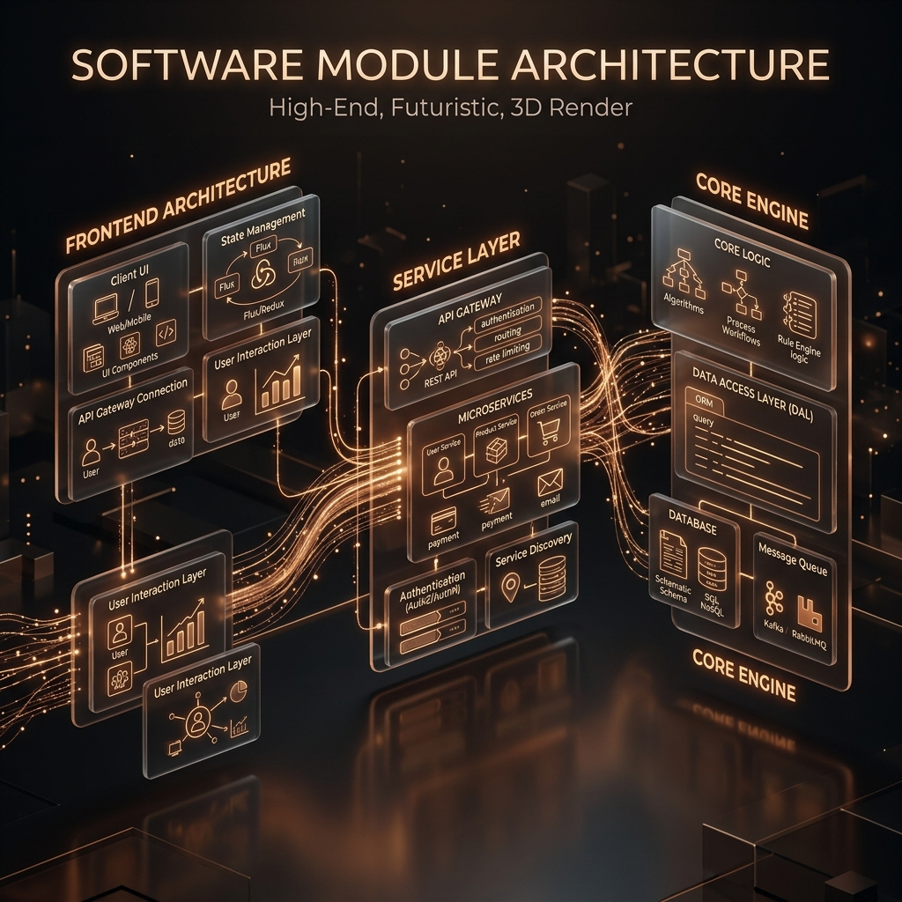
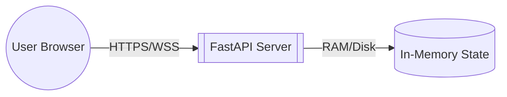
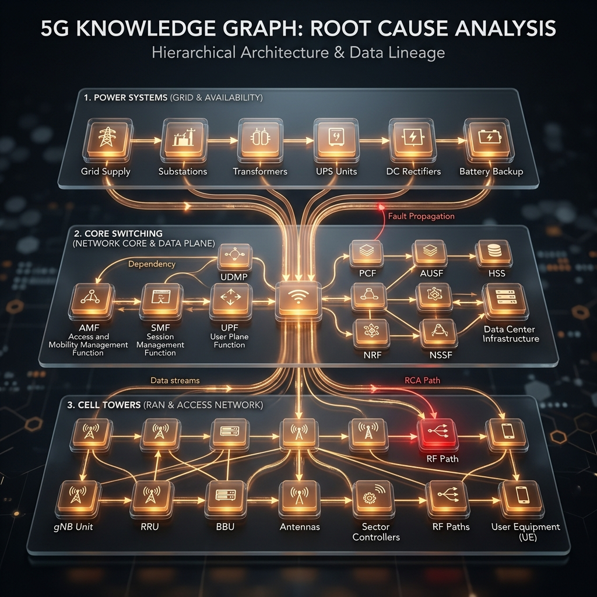

# 🛰️ Telco-RCA: AI-Driven Root Cause Analysis
### **Autonomous 5G Outage Troubleshooting & Causal Reasoning**

---

[](https://opensource.org/licenses/MIT)
[](https://fastapi.tiangolo.com/)
[](https://reactjs.org/)
[](https://vitejs.dev/)
[]()

---

## 📖 Overview
**Telco-RCA** is a state-of-the-art simulation platform that uses **Graph Reasoning** to solve the "Alarm Storm" problem in 5G networks. It transforms thousands of noisy, cascading alerts into a single, explained **Root Cause**, allowing autonomous agents to troubleshoot infrastructure outages with surgical precision.

> **Key Idea**: Move from reactive monitoring to **proactive causal inference** by navigating a hierarchical 5G dependency graph.

---

## ✨ Key Features
- 💠 **Graphical Reasoning**: Interactive 4-layer network topology visualization.
- ⚡ **Real-Time Telemetry**: Live WebSocket-driven alarm feeds and agent logs.
- 🧠 **Explainable AI**: Visual evidence paths showing *why* a node is suspected.
- 📊 **Dynamic Simulation**: 4 difficulty levels (Easy to Extreme) with up to 1000 nodes.
- 📈 **Performance Analytics**: Integrated MTTR, Accuracy, and Efficiency tracking.

---

## 📁 Project Structure



```text
.
├── app/                  # Backend Logic (FastAPI Environment)
├── artifacts/            # System Logs & Generated Outputs
├── assets/               # 3D Infographics & UML Library
├── server/               # WebSocket Gateway & API Handlers
├── src/                  # React Frontend (Vite)
├── tests/                # Unit & Integration Test Suites
├── Dockerfile            # Containerization Configuration
├── index.html            # Application Entry Point
├── inference.py          # AI Agent Reasoning Logic
├── models.py             # Data Schemas & Knowledge Graph Models
├── openenv.yaml          # Environment Configuration
├── package.json          # Node.js Dependencies
├── pyproject.toml        # Python Project Metadata
├── requirements.txt      # Backend Dependencies
├── tailwind.config.js    # Styling Configuration
├── THEORY.md             # Technical Whitepaper
├── uv.lock               # Deterministic Python Lockfile
└── vite.config.js        # Frontend Build Configuration
```

---

## 🏗️ System Architecture



1. **Frontend Layer**: A React-based glassmorphic UI that handles graph visualization and live telemetry via WebSockets.
2. **Service Layer**: An asynchronous FastAPI gateway that orchestrates simulation states and agent reasoning loops.
3. **Causal Engine**: The core logic layer that models 5G dependencies and generates failure propagation patterns.

---

## 📊 UML Logic & Flow

### 👤 Use Case Diagram

*1. Defines user interaction boundaries between the Operator and the Autonomous Agent.*

### 🧬 Class Diagram (Core Components)

*2. Maps the structural data relationships between the Environment, Nodes, and Alarms.*

### 🔁 Sequence Diagram (Troubleshooting Flow)

*3. Tracks the step-by-step lifecycle of a simulation episode from init to submission.*

### 🛠️ Activity Diagram

*4. Illustrates the logical branching of the troubleshooting loop and noise filtering.*

---

## 📦 Module Structure



1. **Frontend Architecture**: Contains modular UI Pages, custom Recharts/SVG components, and highly optimized Simulation Hooks.
2. **Service Layer**: Manages authentication, RESTful routing, and persistent WebSocket connections for real-time updates.
3. **Core Engine**: The scientific heart of the project, including the Scenario Engine, Topology State Manager, and Graders.

---

## 🚀 Deployment Diagram


---

## 🔄 Application Flow



1.  **Initialization**: User selects one of 4 scenarios (Easy to Extreme).
2.  **Cascade**: The engine triggers a fault; alarms propagate via the Knowledge Graph.
3.  **Discovery**: The operator uses tooltips and filters to differentiate noise from symptoms.
4.  **Resolution**: The AI Agent or User submits a diagnosis; the system validates accuracy.

---

## 🛠️ Tech Stack
- **Frontend**: React 18, Vite, Tailwind CSS, Framer Motion, Recharts
- **Backend**: Python 3.10+, FastAPI, Uvicorn
- **State**: React Hooks (Custom Simulation Logic)
- **Visualization**: Custom SVG Graph Engine

---

## ⚙️ Installation & Setup

### Prerequisites
- Node.js 18+
- Python 3.10+

### Setup Commands
```bash
# Clone the repository
git clone https://github.com/your-username/telco-rca.git
cd telco-rca

# Install Backend Dependencies
pip install -r requirements.txt

# Install Frontend Dependencies
npm install
```

---

## ▶️ Running the Application

To start the full development environment (Backend + Frontend), run:

### 1. Start the Backend (FastAPI)
```bash
# From the project root
python app/main.py
```

### 2. Start the Frontend (Vite)
```bash
# In a new terminal tab
npm run dev
```

The application will be available at **http://localhost:5173**.

---

---

## 🧪 Future Enhancements
- [ ] **Multi-Fault Injection**: Handling overlapping outages simultaneously.
- [ ] **NLP Command Interface**: Controlling the agent via natural language.
- [ ] **Temporal Analysis**: Time-series forecasting for predictive RCA.

---

## 🏆 Why this project stands out
Unlike basic monitoring tools, this project implements a **Functional Cognitive Loop**. It doesn't just show data; it **reasons** through it using physical and logical graph hierarchies, providing a true "Mission Control" experience.

---

## 🤝 Contributors
Developed with precision by **Ayushman Sahoo**.

## 📜 License
This project is licensed under the MIT License.
