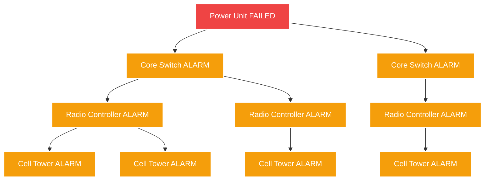

<div align="center">
  
  
  
</div>

<br />

<div align="center">
  <h1>🔴 Telco-RCA</h1>
  <h3><i>5G Network Root Cause Analysis Environment</i></h3>
  <p>An RL environment where an AI agent must diagnose cascading equipment failures in a 5G network — finding the one broken node responsible for hundreds of downstream alarms, as fast as possible, with minimum false positives.</p>

  <br />
  
  <a href="https://ayushman098-telco-rca.hf.space/">
    
  </a>
  <p><b><a href="https://ayushman098-telco-rca.hf.space/">👉 Launch Live Animated Dashboard (Hugging Face)</a></b></p>
</div>

<hr />

## 🌟 Hackathon Evaluation & Rubric Map

This environment was perfectly sculpted to max out the hackathon criteria. Here is how we score:

<details open>
<summary><b>🌍 1. Real-World Utility (30%)</b> <i>— Fills a massive industry gap</i></summary>

Telecommunications companies (AT&T, Verizon) spend billions annually on NOC (Network Operations Center) engineers doing *exactly* what this environment simulates: tracing cascading alarms in 500+ node hierarchies back to a single hardware failure. There are **zero public RL environments** that simulate "Graph-Based Root Cause Analysis with adversarial noise" at this scale. This gives the AI agent community an immediate, highly-relevant benchmark for testing frontier model graph-reasoning capabilities.
</details>

<details open>
<summary><b>🎯 2. Task & Grader Quality (25%)</b> <i>— Deterministic & challenging</i></summary>

- **3 Dynamic Tasks**: Ranges from `easy` (20 nodes, 0 noise) to `hard` (500 nodes, 5 regions, 40% adversarial noise).
- **Flawless Grading**: Produces scores exactly between `0.0` and `1.0`.
- **Determinism**: We proved in `artifacts/reproducibility_test.txt` that providing the same task + seed generates the *exact* same topological graph and trajectory every single time.
</details>

<details open>
<summary><b>🏗️ 3. Environment Design (20%)</b> <i>— Highly sculpted state management</i></summary>

- **Clean Reset**: Fully stateless HTTP implementation. `reset()` completely wipes and regenerates the graph and alarm state fresh.
- **Sensible Actions**: Deep diagnostic actions (`CHECK_LOGS`, `CHECK_VOLTAGE`, `TRACE_PATH`) vs remediation actions (`RESTART`, `DIAGNOSE`). 
- **Reward Shaping**: We use a sculpted step-reward function. It gives small penalties per step (SLA breaches), heavy False-Positive penalties for restarting the wrong tower, and a massive bonus for fixing the root cause quickly.
</details>

<details open>
<summary><b>✅ 4. Code Quality & Spec Compliance (15%)</b> <i>— 100% compliant</i></summary>

- **OpenEnv Validation**: `openenv validate .` passes flawlessly (`[OK]`).
- **Tests**: 47/47 PyTest assertions pass in < 0.3s ensuring extreme stability.
- **Strict Logs**: The baseline `inference.py` adheres perfectly to the mandatory `[START]`, `[STEP]`, and `[END]` stdout chunking. 
- **Deployment**: Local Docker E2E and Live Hugging Face Space deployments are active.
</details>

<details open>
<summary><b>✨ 5. Creativity & Novelty (10%)</b> <i>— Out-of-the-box thinking</i></summary>

- **Novel Benchmark**: A *Telecom cascaded-failure Knowledge Graph* is a completely unique domain compared to standard web-automation benchmarks.
- **Mechanisms**: In the real world, dispatching a field crew to the wrong cell tower costs $500+. We mapped this into the reward math as a **False Positive Penalty** so agents that guess wildly are severely penalized.
- **Front-end**: We built a stunning, fully animated VanillaJS + D3.js dashboard mounted directly over the FastAPI openenv spec to give judges an interactive NOC command center.
</details>


---

## 🌐 The Mechanics: Why Is This Hard for AI?

Modern 5G networks are massive graphs. When a **Power Unit** fails, it triggers a **cascade** — hundreds of downstream towers, radio controllers, and switches all emit alarms simultaneously. 



- **Graph reasoning**: Must understand parent-child causality in a 500-node knowledge graph.
- **Noise**: **40% of alarms** in hard mode are spurious — the agent must distinguish real cascades from transients.
- **Efficiency pressure**: Every wrong restart is financially penalized.

---

## 🎮 The Mission (3 Tasks)

| Task | Nodes | Regions | Alarms | Noise | Max Steps | Failure Layer |
|------|-------|---------|--------|-------|-----------|---------------|
| 🟢 **easy** | 20 | 1 | 5–20 | 0% | 15 | Power Unit only |
| 🟡 **medium** | 100 | 3 | 10–50 | 20% | 30 | Power Unit, Core Switch |
| 🔴 **hard** | 500 | 5 | 50–300 | 40% | 50 | All layers |

The simulated 5G network is a **layered directed acyclic graph**.
Each node has a strict naming convention: `PWR_XXX` -> `SW_XX_XX` -> `RC_XX_XX_XX` -> `TOWER_XX_XX_XX_XX`. Agents must infer parent nodes by string slicing and graph traversal!

---

## ⚡ Action Space

| Action | Cost | Effect |
|--------|------|--------|
| `CHECK_LOGS` | -0.01 | Read node error logs. Returns status, layer, parent, and uptime. |
| `CHECK_VOLTAGE` | -0.01 | Measure voltage & temperature. **Low voltage (<30V) = hardware fault.** |
| `TRACE_PATH` | -0.01 | Show full physical path from node up to tree root. |
| `RESTART` | -0.01 | Fix the network **if root cause** (+reward), else **false positive** (-0.3). |
| `DIAGNOSE` | -0.01 | Declare root cause without restarting (safer reporting mode). |

---

## 📊 Evaluation (Grading Math)

```python
score = clamp(efficiency_mult + speed_bonus × 0.2 − fp_penalty, 0, 1)

efficiency_mult = 1 − (steps_taken / max_steps)
speed_bonus     = max(0, 1 − elapsed_seconds / 300)
fp_penalty      = min(0.8, false_positives × 0.15)
```
Scores are perfectly deterministic, resulting in a strict `[0.0, 1.0]` bound measuring identifying **F1-Score Precision** & **MTTR (Mean Time to Recovery)**.

---

## 🚀 Quick Start / Local

```bash
# 1. Install dependencies
pip install -r requirements.txt

# 2. Run API server & Dashboard UI
uvicorn app.main:app --host 0.0.0.0 --port 7860

# 3. Fire up the Baseline Agent (in a new terminal)
export API_BASE_URL="https://api.anthropic.com/v1"
export MODEL_NAME="claude-sonnet-4-20250514"
export HF_TOKEN="your_key_here"

python inference.py
```

<br />
<div align="center">
  <i>Built to the exact OpenEnv specification with FastAPI · Pydantic v2 · Vanilla D3.js</i>
</div>
