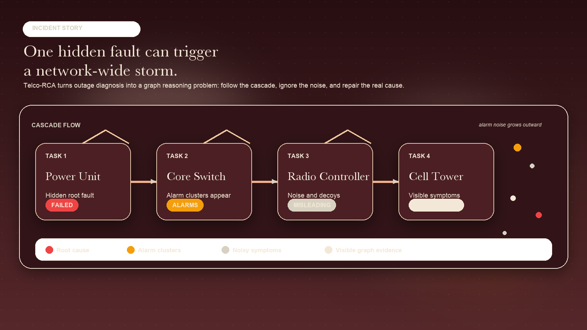
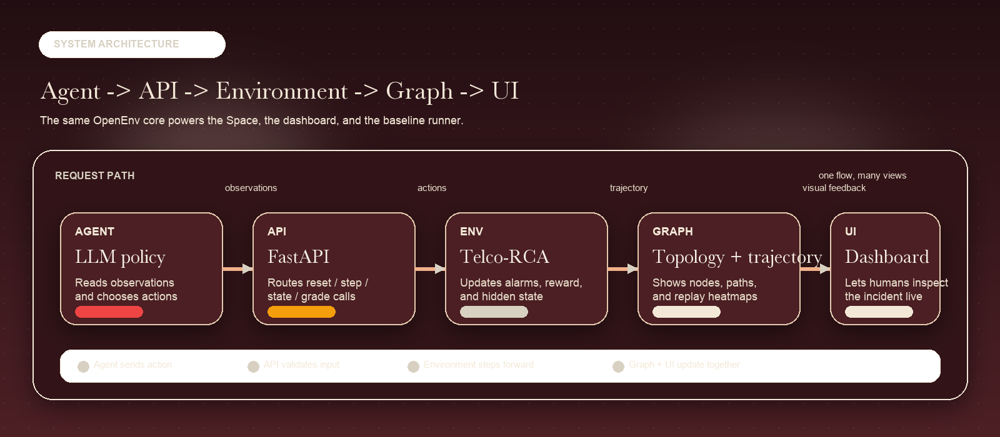
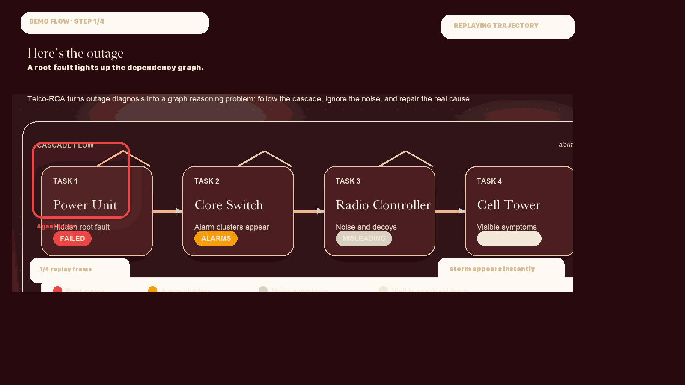

<p align="center">
  
</p>

<h1 align="center">Telco-RCA</h1>
<p align="center">
  <strong>OpenEnv telecom root-cause analysis, built for graph reasoning agents</strong>
</p>

<p align="center">
  <a href="https://ayushman098-telco-rca.hf.space/">
    
  </a>
  
  
  
</p>

> We built a telecom outage simulator where AI agents don’t just predict failures — they investigate, reason, and fix them like real network engineers.
>
> Every episode turns a hidden network fault into an interactive graph-reasoning incident with noisy alarms, typed actions, and an explainable trajectory.

## Why this environment exists

Real telecom operations are not clean puzzle boards. They are noisy, layered, and time sensitive.
When a power unit fails, the alarms do not stay local. They ripple through switches, radio controllers, and towers across multiple regions.
Telco-RCA models that workflow in a way that is useful for:

- diagnosing root causes in a dependency graph
- practicing decision-making under alarm noise
- comparing agents on efficiency, accuracy, and recovery speed
- visualizing how an agent actually reasoned through the incident

## At a glance

- Four difficulty tiers: `easy`, `medium`, `hard`, and `extreme`
- Deterministic OpenEnv episodes with typed models and repeatable seeds
- Action-based diagnosis with logs, voltage checks, tracing, restart, and final diagnosis
- Reward shaping that balances efficiency, correctness, and false positives
- Trajectory replay with path history, reward breakdown, and heatmap data
- Dockerized deployment for local use and Hugging Face Spaces

## One result worth showing

The exact structured benchmark excerpt is archived in [`artifacts/baseline_snapshot.txt`](artifacts/baseline_snapshot.txt).

| Task | Steps | Score | Outcome |
|:---|:---:|:---:|:---|
| `easy` | 14 | 0.09 | Succeeds after a longer diagnostic sweep |
| `medium` | 8 | 0.97 | Clean recovery with strong confidence |
| `hard` | 13 | 1.00 | Correct diagnosis and repair |
| `extreme` | 17 | 1.00 | Worst-case tier solved under heavy noise |

> **Note on easy scores:** The low score on `easy` reflects grading efficiency, not failure.
> The agent succeeded but used more steps and had false positives, which the grader penalises.
> A perfect easy run (fast, zero false positives) scores close to 1.0 — the tier is intentionally
> unforgiving to reward precise, confident agents over brute-force exploration.

That is the kind of result that makes the environment feel benchmark-ready, not just visually polished.

## What makes it a strong benchmark

- Real-world utility: it models a telecom network operations workflow, not a toy game
- Task quality: the tier ladder is clean, reproducible, and gets harder in meaningful ways
- Environment design: the observation and action spaces stay typed, bounded, and interpretable
- Feedback quality: step rewards, terminal scores, and trajectory logs all tell part of the story
- Deployment readiness: it runs locally, in Docker, and on Hugging Face Spaces with the same API surface

## Why this wins

- Not a classifier -> interactive decision system
- Not static -> agent learns through environment interaction
- Not black-box -> trajectory, reward breakdown, and heatmap explain the run
- Not a toy -> telecom operators recognize the workflow and the failure cascade
- Not single-shot -> every step belongs to a recoverable incident story

## One visual that explains everything

Graph + failure cascade + agent path, all in one glance.

<p align="center">
  
</p>

The environment simulates a layered network where a single root fault can trigger a long alarm chain. Higher tiers add:

- larger topologies
- deeper dependency trees
- more noise and false alarms
- stricter pressure on recovery time

Judges should understand the story in about five seconds:

- one hidden fault
- one expanding cascade
- one agent path through the graph
- one repaired root cause at the end

## System architecture

<p align="center">
  
</p>

Agent -> API -> Environment -> Graph -> UI

## Task tiers

| Task | Nodes | Regions | Max Steps | Noise | What it tests |
|:---|:---:|:---:|:---:|:---:|:---|
| `easy` | 20 | 1 | 15 | 0% | Basic fault isolation in a small network |
| `medium` | 100 | 3 | 30 | 20% | Correlating multiple alarms across a cluster |
| `hard` | 500 | 5 | 50 | 40% | Multi-hop reasoning across a large topology |
| `extreme` | 1000 | 8 | 75 | 60% | Worst-case RCA under heavy noise and deep cascades |

Each reset builds the exact configured node count for the chosen tier.

## Action space

| Action | What it does |
|:---|:---|
| `CHECK_LOGS` | Inspect node logs and alarm context |
| `CHECK_VOLTAGE` | Measure voltage for hardware diagnosis |
| `TRACE_PATH` | Walk the dependency chain from a node upward |
| `RESTART` | Repair the selected node if it is the true root cause |
| `DIAGNOSE` | Declare the likely root cause without restarting it |

## Observation space

Agents receive a structured observation with:

- active alarms and total alarm count
- steps remaining and episode completion state
- checked nodes and false positives so far
- network summary by layer and region
- simulation time and alarm age statistics
- a graph snapshot for graph-aware policies and visualization

## Reward and grading

The environment gives step-level shaping, while the final grade normalizes the run into a score between `0.0` and `1.0`.

Core signals:

- fewer steps is better
- faster recovery is better
- fewer false positives is better
- correct diagnosis and repair matter more than brute-force exploration

The grading layer also tracks:

- root-cause identification quality
- MTTR-style recovery speed
- false-positive penalties
- checked node and layer coverage

## Trajectory view

Telco-RCA includes a trajectory endpoint and dashboard panel that show how the agent solved the incident:

- agent path through the graph
- actions taken with timing
- reward breakdown per step
- heatmap of checked nodes
- replay scrubber for stepping through the episode

This is useful when you want to understand not just whether an agent succeeded, but how it reasoned.

## Demo flow

When you present the demo, it should feel like this:

1. "Here’s the outage"
2. "Look at the chaos"
3. "Watch the agent think"
4. "Boom — root cause found"

<p align="center">
  
</p>

## Quick start

### Docker

```bash
docker build -t telco-rca .
docker run -p 7860:7860 \
  -e API_BASE_URL=https://api.anthropic.com/v1 \
  -e MODEL_NAME=claude-sonnet-4-20250514 \
  -e HF_TOKEN=your_key \
  -e PUBLIC_BASE_URL=http://localhost:7860 \
  -e INTERNAL_API_TOKEN=change-me \
  telco-rca
```

Open `http://localhost:7860` after the container starts.

### Local development

```bash
pip install -r requirements.txt
npm ci

# Terminal 1
uvicorn app.main:app --host 0.0.0.0 --port 7860

# Terminal 2
npm run dev

# Production frontend build
npm run build
```

The built frontend is served from `app/static/` by FastAPI.

### Baseline agent

`inference.py` runs a reproducible baseline and accepts either `HF_TOKEN` or `OPENAI_API_KEY`.

```bash
SERVER_URL=https://ayushman098-telco-rca.hf.space python inference.py
```

### Benchmark sweep

`run_baseline.sh` runs multiple episodes per tier and writes a summary with mean score, standard deviation, and MTTR-style timing.

```bash
chmod +x run_baseline.sh
./run_baseline.sh --episodes 5 --output artifacts/baseline_report.txt
```

An example output format is stored in:

- `artifacts/baseline_report_example.txt`

## Hugging Face Space configuration

Set these secrets in the Space settings:

- `HF_TOKEN` or `OPENAI_API_KEY`
- `API_BASE_URL`
- `MODEL_NAME`
- `PUBLIC_BASE_URL`
- `INTERNAL_API_TOKEN` if you want to enable `/state/internal`
- `ALLOWED_ORIGINS` if you want to override the default CORS policy

The Space container now exposes a readiness route at `GET /ready`, and the Docker healthcheck uses that endpoint.

## API reference

| Method | Path | Purpose |
|:---|:---|:---|
| `GET` | `/health` | Liveness and version check |
| `GET` | `/ready` | Readiness check for the UI assets and task registry |
| `GET` | `/tasks` | List all available task tiers |
| `POST` | `/reset` | Start a new episode |
| `POST` | `/step` | Apply an agent action |
| `GET` | `/state` | Safe runtime state for the UI and agents |
| `GET` | `/trajectory` | Step-by-step replay, reward series, and node heatmap |
| `GET` | `/state/internal` | Token-protected debug state |
| `POST` | `/grade` | Score a full trajectory |

## Project structure

```text
.
├── app/                  # FastAPI backend, environment, models, graders
├── src/                  # React dashboard and visualization components
├── inference.py          # Baseline agent runner
├── run_baseline.sh       # Multi-episode benchmark sweep
├── openenv.yaml          # OpenEnv manifest
├── Dockerfile            # Space-ready container build
└── artifacts/            # Reproducibility and benchmark logs
```

## Validation

The repository includes:

- OpenEnv manifest metadata in `openenv.yaml`
- typed Pydantic models for observations, actions, and trajectories
- a Docker build that serves both API and frontend from one container
- a live dashboard on Hugging Face Spaces
- reproducibility logs and benchmark outputs under `artifacts/`

## License

MIT
Create a premium 16:9 product demo animation for a telecom root-cause analysis dashboard.

Style:
deep burgundy background, warm ivory typography, gold and red accents, elegant motion-design, enterprise-grade, clean, high contrast, minimal clutter.

Storyboard:
1. "Here’s the outage" — a root fault glows red on the left side of a network cascade.
2. "Look at the chaos" — alarm clusters spread outward across the dependency graph.
3. "Watch the agent think" — a glowing agent path traces logs, voltage checks, and upstream tracing.
4. "Boom — root cause found" — the true root-cause node is repaired and the cascade collapses.

Camera and motion:
slow zooms, subtle parallax, smooth fades between beats, gentle glow effects, seamless loop.

Important:
keep the composition readable, leave space for captions, avoid gibberish text, avoid extra UI clutter, and make the final result feel like a polished product launch video.

## Credits

Riddhi Pundhir & Ayushman Sahoo & Saranya Uduthuri
