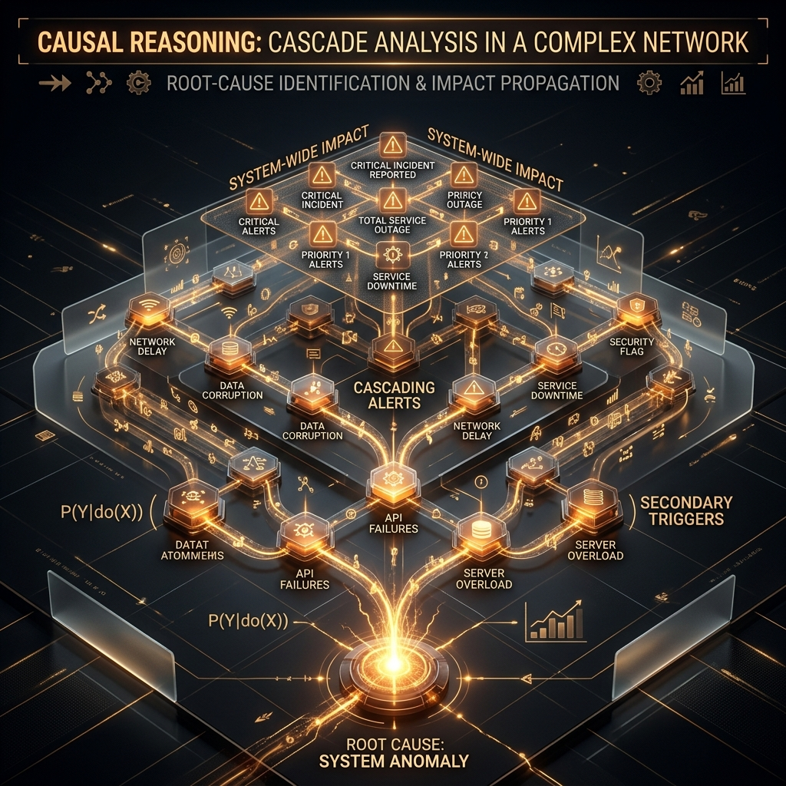

# 🔬 Theory & Causal Reasoning Research
### **Benchmarking Autonomous Decision Integrity in Noisy 5G Environments**

---

---

## 🎯 1. Problem Motivation
Root Cause Analysis (RCA) in telecom systems is difficult because the alarms operators see are usually **effects**, not **causes**. A single hardware failure can trigger a large downstream cascade: a failed power unit may surface as controller instability, transport degradation, and tower-level service alarms across multiple regions.

Telco-RCA is motivated by the need for environments that test **structured causal reasoning under uncertainty**, not just simple alarm classification.

---

## 🌋 2. Why This Problem is Hard
Telecom maintenance faces four critical challenges that this project simulates:

1. **Hierarchy Graphs**: Reasoning must happen over layers (Power → Core → Tower), not flat datasets.
2. **Noise-to-Signal Ratio**: High noise means local signals frequently mislead.
3. **Delayed Effects**: Causal effects often manifest seconds or minutes after the initial fault.
4. **Partial Observability**: The core cause is hidden; agents must choose actions to reveal it.

---

## 🧪 3. Our Approach: Interactive Graph Reasoning
Telco-RCA frames debugging as an interactive graph-reasoning environment built around a realistic 4-layer topology. On top of this structure, it adds:

- **Failure Injection**: Realistic faults at different infrastructure layers.
- **Alarm Propagation**: High-fidelity cascading behavior.
- **Decision Costs**: Every `CHECK_LOGS` or `TRACE_PATH` action increases MTTR, incentivizing efficiency.

---

## 🏆 4. Scientific Novelty
Telco-RCA bridges the gap between toy simulators and real industrial operations by combining:
*   **Hierarchical Dependencies**
*   **Adversarially Noisy Signals**
*   **Exploration-based Diagnosis** (Sequential decision-making vs One-shot prediction)

---

## 🌍 5. Real-World Relevance
In real 5G Network Operations Centers (NOC), human teams must manage "Alarm Storms." This project mirrors that workflow, capturing the practical tension between speed and correctness:
- Recover infrastructure quickly (MTTR).
- Avoid "False Dispatches" (sending engineers to the wrong tower).
- Isolate symptoms from genuine root causes.

---

## 📈 6. Benchmark Potential
The platform allows rigorous comparison across different agent classes:
- **Heuristic-based agents** (Traditional rules)
- **GNN-based models** (Spatial reasoning)
- **LLM-based agents** (Causal log parsing)

---

## 🔭 7. Future Extensions
- **Multi-Root Failures**: Handling overlapping, simultaneous outages.
- **Temporal Graphs**: Evolving topology and dynamic alarm timing.
- **Probabilistic Causality**: Moving from deterministic propagation to stochastic models.
